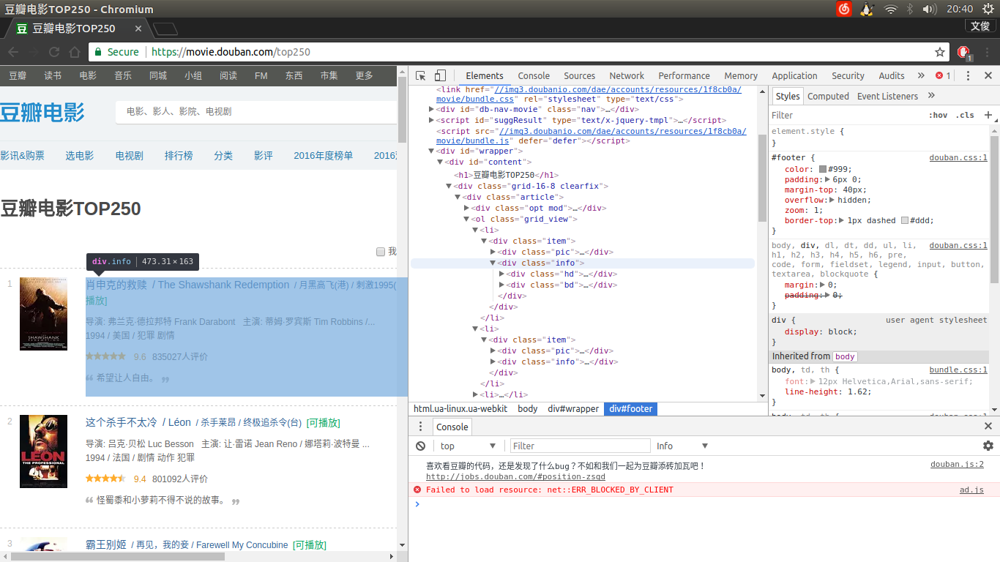
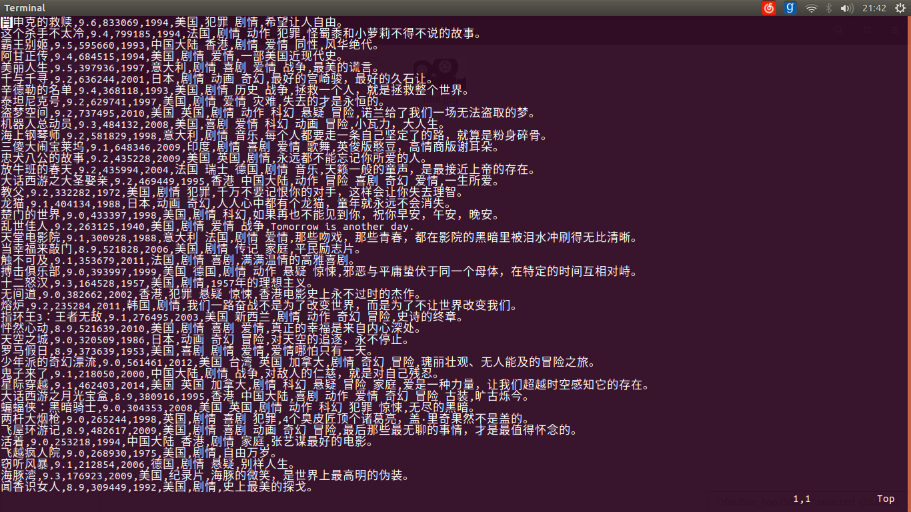

# C2 数据收集  

我们在抓取信息之前先看一下豆瓣网的[robots协议](https://www.douban.com/robots.txt):

```
User-agent: *
Disallow: /subject_search
Disallow: /amazon_search
Disallow: /search
Disallow: /group/search
Disallow: /event/search
Disallow: /celebrities/search
Disallow: /location/drama/search
Disallow: /forum/
Disallow: /new_subject
Disallow: /service/iframe
Disallow: /j/
Disallow: /link2/
Disallow: /recommend/
Disallow: /trailer/
Disallow: /doubanapp/card
Sitemap: https://www.douban.com/sitemap_index.xml
Sitemap: https://www.douban.com/sitemap_updated_index.xml
# Crawl-delay: 5

User-agent: Wandoujia Spider
Disallow: /
```

可以看到我们要抓取的`/top250`并不在禁止之列，那么在不影响服务器性能的前提下，可以合理的运用爬虫来抓取所需的信息。

抓取信息的第一步，引入`Python`的`HTTP`库`requests`用来模拟浏览器登录网页，解析网页`Html`文档的库`lxml`以及用来匹配文本信息的正则表达式库`re`。  

> 由于网页结构相对比较简单，所以这里直接使用`xpath`来定位标签，获取对应所需的信息。其实也可以引入`BeautifulSoup`库简化定位标签节点的过程。  

```python
import requests
from lxml import html
import re
```
定义一个抓取函数，其中用到`requests`库的`get`方法模拟`http`的`get`请求来获取信息，得到一个名为`r`的`requests`对象。   

```python
def get_html_text(url， headers):
    try:
        r = requests.get(url=url, headers=headers)
        r.raise_for_status()
        r.encoding = r.apparent_encoding
        return r.text  # 响应内容
    except:
        return 'Gather Error'
```
其中：  

1. `raise_for_status()`方法的作用是：若`requests`对象的状态码不为`200`，则引发`HTTPError`异常。  
2. `r.encoding`为`HTTP header`中猜测的响应编码方式，`r.apparent_encoding`为从内容中分析出的响应内容编码方式。  
 
 
根据观察可以看出`250`条电影信息存放在`10`个页面内，使用变量`i`计数,在`0～10`个页面内抓取信息。此函数需要使用变量计数，记录抓取电影的个数，此变量设置为`x`，每个循环内的`x`即为当前页面内抓取的信息条数。抓取页面信息使用的是`requests`库的`get`方法，再使用`text`方法得到页面文本内容。  




观察网页源码可以看出，所有的信息都在每个`class`属性为`info`的`div`标签里。依此类推定位到各信息所在标签，代码如下：  

```python
def douban_top250_spyder(text, x):  # 用于定位信息
    # 所有的信息都在class属性为info的div标签里
    for j in text.xpath('//div[@class="info"]'):
        title = j.xpath('div[@class="hd"]/a/span[@class="title"]/text()')[0]  # 影片名称
        info = j.xpath('div[@class="bd"]/p[1]/text()')  # 信息段
        rate = 9j.xpath('div[@class="bd"]/div[@class="star"]/span[@class="rating_num"]/text()')[0]  # 评分
        com_count0 = j.xpath('div[@class="bd"]/div[@class="star"]/span[4]/text()')[0]  # 评论人数
        com_count = re.match(r'^\d*', com_count0).group()  # 仅保留数字
        quote0 = j.xpath('div[@class="bd"]/p[@class="quote"]/span[@class="inq"]/text()')  # 短评
        quote = '无' if quote0 == [] else quote0[0].replace(",", "，")  # 若短评不存在则使用‘无’替代，并将短评中的英文逗号替换为中文逗号，避免影响CSV文件的处理
        date = info[1].replace("\n", "").strip(' ').split("\xa0/\xa0")[0]  # 上映日期
        country = info[1].split("\xa0/\xa0")[1]  # 制片国家
        genre = info[1].replace("\n", "").strip(' ').split("\xa0/\xa0")[2]  # 影片类型

```

打印出得到的信息，在控制台核查：  

```python
print("x" % str(k), title, rate, com_count, date, country, genre, quote)  # 打印结果
```

```
loop 1
1 肖申克的救赎 9.6 835810 1994 美国 犯罪 剧情 希望让人自由。
2 这个杀手不太冷 9.4 801886 1994 法国 剧情 动作 犯罪 怪蜀黍和小萝莉不得不说的故事。
霸王别姬 9.5 597808 1993 中国大陆 香港 剧情 爱情 同性 风华绝代。
4 阿甘正传 9.4 686379 1994 美国 剧情 爱情 一部美国近现代史。
5 美丽人生 9.5 399229 1997 意大利 剧情 喜剧 爱情 战争 最美的谎言。
 ...
loop 10
 ...
23 彗星来的那一夜 8.3 149338 2013 美国 英国 科幻 悬疑 惊悚 小成本大魅力。
24 黑鹰坠落 8.5 101144 2001 美国 动作 历史 战争 还原真实而残酷的战争。
25 假如爱有天意 8.2 216192 2003 韩国 剧情 爱情 琼瑶阿姨在韩国的深刻版。
```

写入所得到的信息，以逗号分割，存为`csv`文件。  

```python
with open("douban_top250_demo.csv", "a") as f:  # 写入文件
    f.write("%s,%s,%s,%s,%s,%s,%s\n" % (title, rate, com_count, date, country, genre, quote))
x += 1  # 每条电影信息打印完后计数加一
```

最后，执行代码主体：  
```python
headers_douban = {
        'Accept': '*/*',
        'Accept-Encoding': 'gzip, deflate, sdch, br',
        'Accept-Language': 'zh-CN,zh;q=0.8',
        'Connection': 'keep-alive',
        'Referer': 'http://www.douban.com/',
        'User-Agent': 'Mozilla/5.0 (Windows NT 10.0; Win64; x64) AppleWebKit/537.36 (KHTML, like Gecko)\
         Chrome/58.0.3029.110 Safari/537.36'
    }  # 请求头部

if __name__ == '__main__':  # 执行代码
    for i in range(10):  # 每页25个电影，共10页，程序在其中做循环，抓取信息。
        print('loop', i+1)  # 显示第几圈        
        url_douban = 'https://movie.douban.com/top250?start={}&filter='.format(i * 25)  # 目标网站迭代形式
        text0 = get_html_text(url_douban, headers_douban)  # 请求得到的网页文本内容
        text_douban = html.fromstring(text0)  # 转换为html类数据，便于xpath处理获取信息
        num_counting = 1  # 计数
        douban_top250_spyder(text_douban, num_counting)
```

得到的效果如下:  



[完整代码](../code/douban_top250_spyder.py)

------

[上一章： C1 概要](c1-Target.md)

[下一章： C3 数据处理](c3-Process.md)


