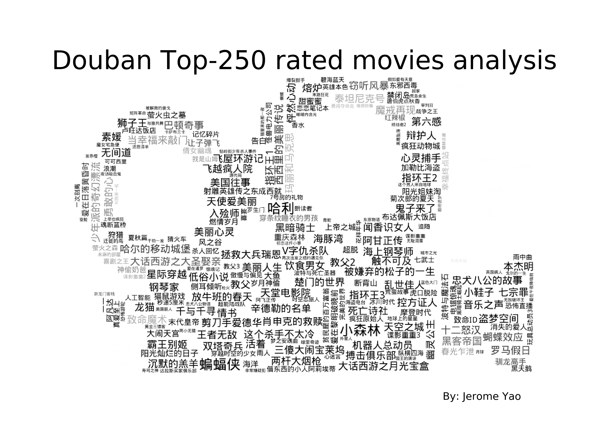
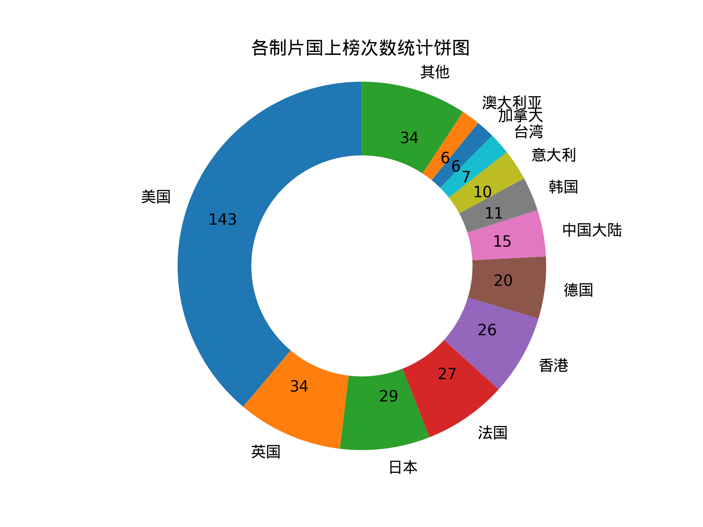
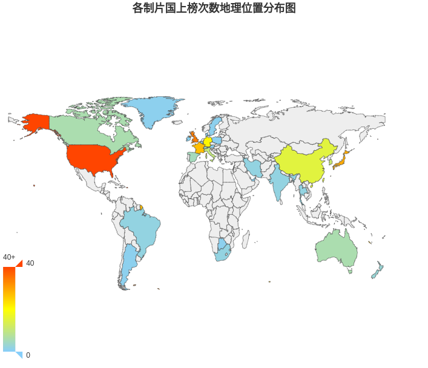
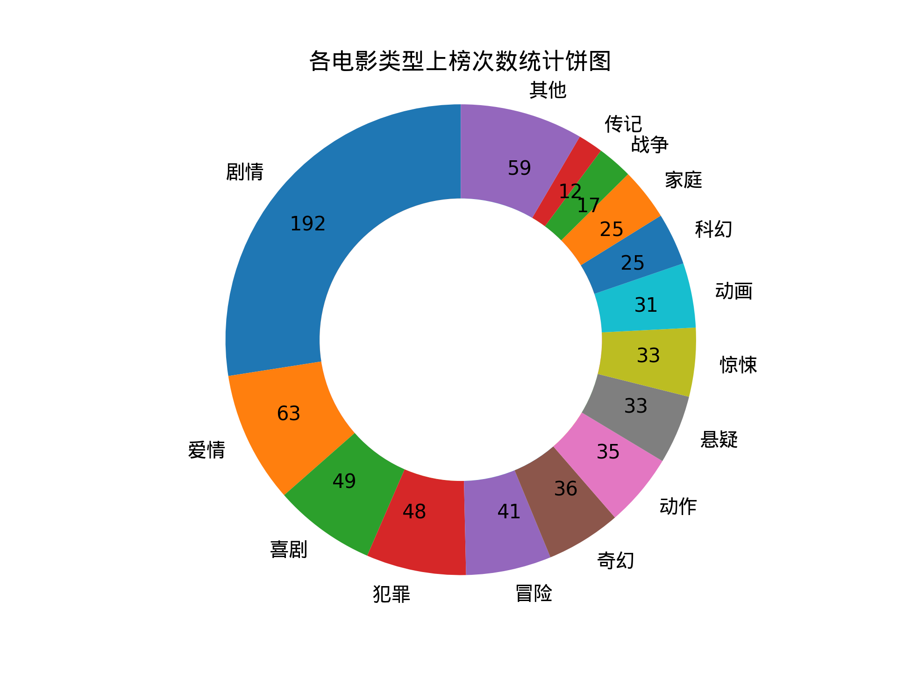
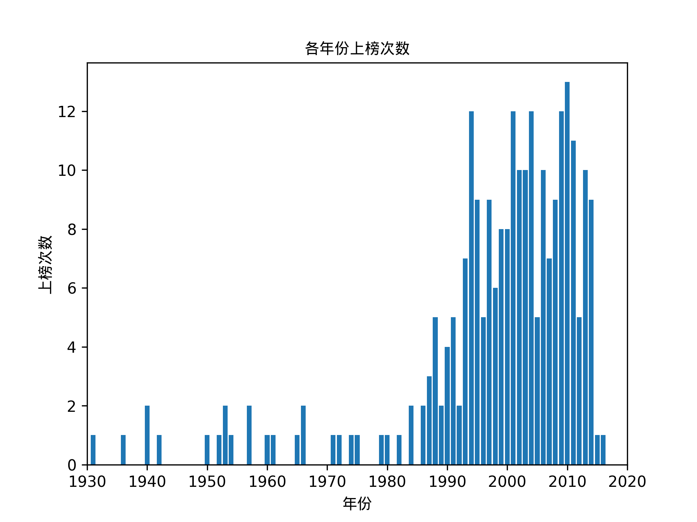
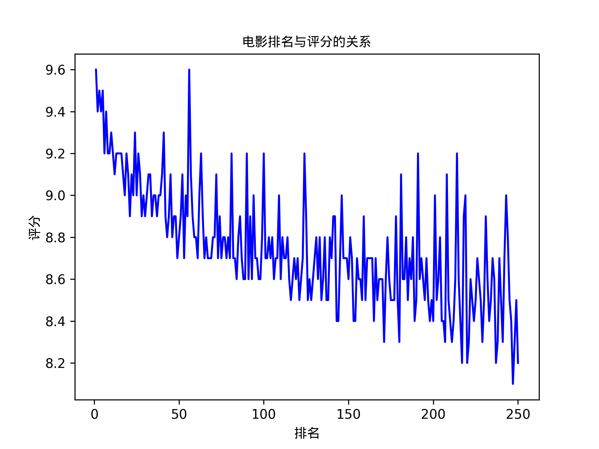
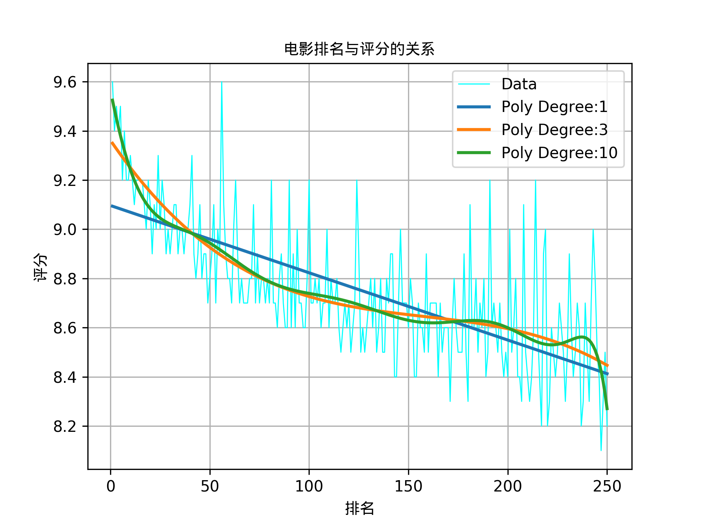
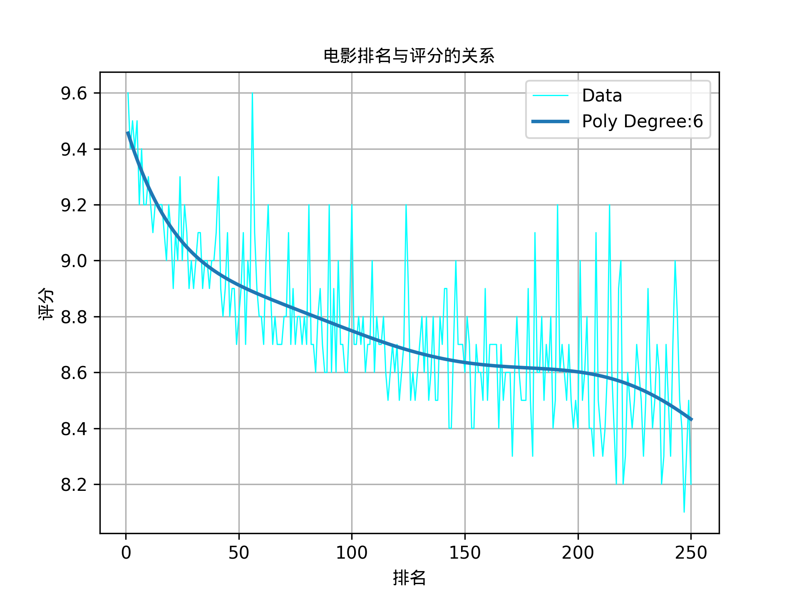
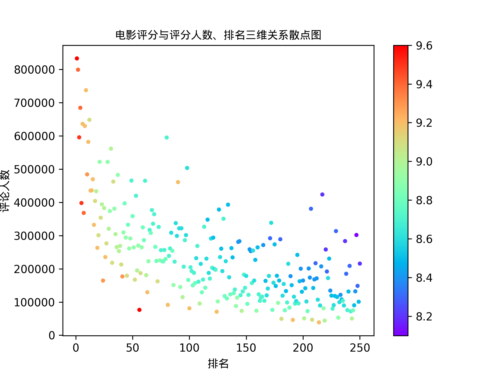

# C4 分析与展示

在分析豆瓣榜单排名之前，让我们来考虑一下几个常见的问题：

* 首先从电影方面，一部一百人评价的电影得到的总评分为`9.9`，一部十万人评价的电影得到的总分为`9.0`，这两部影片到底哪一部作品更优秀，应该排在前面？

* 随着互联网的爆炸式发展，新上映的影片受关注度往往会比过往的影片多得多。  
  这种情况最典型的例子就是随着电影业的发展，以往被奉为经典的电影可能还没有最新上映的普通影片在一个月能的评价多。举一个例子，我们对比一下最近上映了一个多月的[《摔跤吧！爸爸》](https://movie.douban.com/subject/26387939/)与四十多年的经典之作[《教父》](https://movie.douban.com/subject/1291841/)的评分：  
    
  可以看到两者的均分和打分人数十分接近，那么这两部影片是不是同样好的呢？  
  这就不得而知了。

* 我们再从豆瓣的平台属性来看，作为综合性社区影片打分的人群并是不一定为了体现电影的优劣。比如某些明星的粉丝或是某些喜欢特定类型片的观众会带有明显的倾向性，例如:  
  

以上几点都是不容小觑的问题，会极大的影响榜单的合理性。因此排名算法如何消除这些干扰因素，对于这个榜单来说是一个关键所在。

---

由于豆瓣电影排名的具体算法并未对外公开，只有在[《算法工程师如何改进豆瓣电影 TOP250》](https://blog.douban.com/douban/2013/07/04/2630/)这篇豆瓣日志中谈到了其算法理念，所以我们无法直接从豆瓣网排名算法的角度上讨论。但是文中提到了业界老大哥`IMDb`的榜单算法，豆瓣电影评分的榜单算法或多或少有其影子存在。  
`IMDb`网站是目前互联网上最为权威、系统、全面的电影资料网站，里面包括了几乎所有的电影，以及`1982`年以后的电视剧集。`IMDb`的资料中包括了影片的众多信息，演员，片长，内容介绍，分级 ，评论等，它所特有的电影评分系统深受影迷的欢迎，注册的用户可以给任何一部影片打分并加以评述，而网站又会根据影片所得平均分、选票的数目等计算得出影片的加权平均分并以此进行`TOP250`的排名。  
`IMDb`的算法在其[官方网站](http://www.imdb.com/help/show_leaf?votestopfaq&pf_rd_m=A2FGELUUNOQJNL&pf_rd_p=2398042102&pf_rd_r=1R7MKTKRHQ8ZMG6KXPZZ&pf_rd_s=center-1&pf_rd_t=15506&pf_rd_i=top&ref_=chttp_faq)有如下的解释：

> The following formula is used to calculate the Top Rated 250 titles. This formula provides a true 'Bayesian estimate', which takes into account the number of votes each title has received, minimum votes required to be on the list, and the mean vote for all titles:
>
> weighted rating \(WR\) = \(v ÷ \(v+m\)\) × R + \(m ÷ \(v+m\)\) × C   
> Where:   
> R = average for the movie \(mean\) = \(Rating\)  
> v = number of votes for the movie = \(votes\)  
> m = minimum votes required to be listed in the Top 250  
> C = the mean vote across the whole report

* 第一个参数`R`是该电影按照常规方法算出的评分算术平均数；
* 第二个参数`v`是评分的有效评分人数,需要注意的是这个人数只有符合一定投票要求的人才会被计算在内；
* 第三个参数`m`是进入`IMDb TOP250`榜单需要的最小评分人数；
* 第四个参数`C`是目前所有影片的平均分数。                         

这个方法的本质是一个基础的贝叶斯平均，这个公式的目的为的是通过每部影片的【评分人数】作为调节排序的主要手段：如果这部影片的评分人数低于一个预设值，则影片的最终得分会向全部影片的平均分靠近。然后，随着豆瓣电影排名访问人数的日益增长，`IMDb`将自己的入榜最小值`m`不断调整以适应投票环境的变化。使用动态公式带来的算法优势是可以避免小众电影的排名偏高，很好地解决了我们在本段落提出的问题一。

但是，仅仅依靠贝叶斯平均的方法对于问题二来说是无能为力的。我们需要增加一个时间维度的考察标准来评定，如果该影片仅在上映之初有不错的评价和关注度，之后便持续下滑的话，那么这部影片很难被称为一部好的作品。  

再者，如何有效降低恶意刷分对于排名的影响？这也是大多数公开的算法中没有提到的部分,大抵只能看到些“我们的榜单是不会受到水军影响”之类的豪言壮语。个人认为对于处理此类方法最简单可行的方案便是暂不将热映新片排入TOP250，当影片下映以后脱离商业因素的影响再纳入评判此片是否是一部值得上榜的影片范畴。

---

简单的分析了`IMDb`的排名算法之后，我们可以发现有几个参数对于电影排名起到很重要的作用：**影片的排名**、**电影评分**、**电影评价人数**、**影片上映时间**等。以下从豆瓣电影`TOP250`榜单获取的数据中分析这几个重要的影响因素及其中关系。

### 片名词云

我们可以将这250个电影名称组成一张电影放映机的形象来当作本文的封面照。

```python
text_titles = r' '.join(titles)  # 列表转换成str类
alice_coloring = np.array(Image.open("film.jpg"))  # 读取mask/color图片
image_colors = ImageColorGenerator(alice_coloring)  # 颜色生成器
my_wordcloud = WordCloud(background_color="white",  # 设置背景颜色
                         max_words=2000,  # 设置最大实现的字数
                         mask=alice_coloring,  # 设置背景照片
                         max_font_size=30,  # 设置字体最大值
                         random_state=1  # 设置随机配色数
                         ).generate(text_titles)  # 根据titles生成词云
plt.imshow(my_wordcloud.recolor(color_func=image_colors))  # 再上色并显示
plt.title(s='Douban Top-250 rated movies analysis', fontsize=20)  # 标题
plt.text(800, 700, 'By: Jerome Yao', fontsize=8)  # 签名
plt.axis("off")  # 不显示x, y轴
plt.savefig('filmCloud_demo.png', dpi=500)  # 保存图片
plt.show()  # 展示图片
```

效果如下：



### 制片国分析

我们先来简单的看一下上榜影片的制片国家一共有哪些？每个国家上榜了多少次  
环形图来展现各制片国家所占份额可以更清晰地体现各个国家所占的比例。  
当数据条目较多，且需要明显体现各部分的比例时，环形图是个很好的选择。  
由于存在一部影片由多个国家的团队合作完成，上榜电影的制作国家总和是大于`250`的，在此环形图内的数据单位为“次”而非百分比。

```python
font_initial = matplotlib.rcParams['font.family']  # 初始字体
matplotlib.rcParams['font.family'] = 'Droid Sans Fallback'  # 修改字体
ax0 = plt.subplot()  # 创建子作图区
ax0.set_title('各制片国上榜次数统计环形图')  # 标题
ax0.pie(size, labels=labels, shadow=False, startangle=90)  # 做饼图
matplotlib.rcParams['font.family'] = font_initial  # 还原字体
ax0.pie(size, labels=size, radius=0.6, startangle=90, labeldistance=1.2)  # 环内数值
ax0.pie([1], radius=0.6, colors='w')  # 白心
ax0.axis('equal')  # 正圆
plt.savefig('countries_demo.png', dpi=300)  # 保存图片
plt.show()
```

得到如下图像：  
  
其中美国参与制作的影片数量一骑绝尘，如果再加上英国的份额，这两大英语系国家便可以占到所有上榜电影的半壁江山。
再将数据投射到世界地图上来看看各国家或地区的地理位置和上榜次数的关系。
  
从地理位置角度分析，我们可以明显发现颜色较深即上榜次数较多的地理位置主要分布在欧美和东亚。这一现象体现中国电影文化主要受到两方面因素影响，欧美发达国家的强势文化输入以及自身和就近的东亚文化沉淀。

### 影片类型分析

类型的分布与国家分布类似,同样以环形图来展现。  
这里就不贴代码赘述了，得到图像如下：



如图，我们可以发现剧情片占绝对主导地位，那些传播“正能量”、“励志”、“感人”的影片以其较强的故事性常常能够引起观众的共鸣，获得大众的欢迎并赢得较高的评价。

### 制片年份分析

在制片年份分析部分
在此选择使用直方图展示数据，优点是可以明显根据图像的面积直观感受数据分布。

```python
ax2 = plt.subplot()
ax2.set_title('各年份上榜次数', fontproperties='Droid Sans Fallback')  # 标题，单处修改字体
ax2.set_xlabel('年份', fontproperties='Droid Sans Fallback')  # x轴标签
ax2.set_xlim(1930, 2020)  # 横轴上下限
ax2.set_ylabel('上榜次数', fontproperties='Droid Sans Fallback')  # y轴标签
ax2.bar(keys_date, values_date)  # 画柱状图
plt.savefig('date_demo.png', dpi=300)
plt.show()
```

得到的图像如下：



我们来思考一下，每年上榜的电影数都是可数集，样本空间为 。
取一个极大自然数`n`,我们可以把一个年份分解为等长的`n`段，即
当`n`很大时，每个小区间段有两部电影上榜的概率可以忽略不计。假设每段时间电影上榜的概率相等，即每部电影上榜的概率是独立的，
且反比于`n`，不妨假设为 ,那么一年内总的上榜电影数为：


当 取极限时,有:


我们来总结一下该问题，其满足以下三个特点：

1. 从宏观角度上来看电影上榜TOP250是小概率事件；
2. 电影之间是独立的，也即不会互相依赖或者影响；
3. 电影上榜的概率是稳定的，即必然有250部电影会上榜。

如果某类事件满足上述三个条件，理论上服从泊松分布，所以我们考虑以泊松分布拟合该图像，泊松分布的概率函数为：

在这函数中有个重要参数：， 它代表单位时间内随机事件的平均发生率。

~~拟合图像暂略~~

### 评分与排名关系分析

一般榜单都是按照一个参数（大多为项目评分）降序排列的，评分最高的  
用折线图可以很明显地体现评分与排名的关系趋势

```python
ax3 = plt.subplot()
ax3.set_title('电影排名与评分的关系', fontproperties='Droid Sans Fallback')
ax3.set_xlabel('排名', fontproperties='Droid Sans Fallback')
ax3.set_ylabel('评分', fontproperties='Droid Sans Fallback')
ax3.plot(index_rate, values_rate, 'blue')  # 画折线图
plt.savefig('rate_movie_demo.png', dpi=300)
plt.show()
```

得到折线图如下：  

 
 
我们通过观察图像可以发现数据并不是单纯的的大致走向是一条曲线，那么很可能符合多项式回归:

但数据的离散程度还是相当高的，在这我们使用岭回归方法。岭回归是一种专用于共线性数据分析的有偏估计回归方法，实质上是一种改良的最小二乘估计法，通过放弃最小二乘法的无偏性，以损失部分信息、降低精度为代价获得回归系数更为符合实际、更可靠的回归方法，对病态数据的拟合要强于最小二乘法。
在我们尝试以多项式回归拟合该分布时，还有个很重要的参数就是上式中的`n`，它代表多项式的最高指数（`degree`），但是我们不知道指数选择多少比较合适。所以我们只能一个个去试，直到找到最拟合分布的指数。需要注意的是，如果指数选择过大的话可能会导致函数过于拟合， 意味着对数据或者函数未来的发展很难预测，也许指向不同的方向。
如何找到最拟合分布的指数？我们就要考量其误差情况是否合理，常用的误差分析参数主要有确定性系数（`R2`）。
  
+ `R2`方法是将预测值跟只使用均值的情况下相比，看能好多少，其区间通常在（0,1）之间。如果`R2=0.8`说明变量y的变异性中有80%是由自变量`x`引起的，`R2`越接近`1`代表方程对数据的解释能力越强；如果`R2=1`,表示所有的观测点全部落在回归直线上，即预测跟真实结果完美匹配的情况；如果`R2=0`,则表示自变量与因变量无线性关系，还不如什么都不预测，直接取均值的情况。其计算方法，不同的文献稍微有不同，本文中函数`R2`的实现是使用`sklearn`中的`clf.score`方法。


```python
x = np.array(index_rate)
y = np.array(values_rate)
degree = [1, 3, 10]
ax3 = plt.subplot()
ax3.set_title('电影排名与评分的关系', fontproperties='Droid Sans Fallback')
ax3.set_xlabel('排名', fontproperties='Droid Sans Fallback')
ax3.set_ylabel('评分', fontproperties='Droid Sans Fallback')
ax3.plot(index_rate, values_rate, 'cyan', linewidth=0.7)  # 画折线图
for d in degree:
    clf = Pipeline([('poly', PolynomialFeatures(degree=d)),  # 产生多项式
                    ('linear', linear_model.Ridge())])  # 岭回归
    clf.fit(x[:, np.newaxis], y)
    y_test = clf.predict(x[:, np.newaxis])
    theta_list = clf.named_steps['linear'].coef_
    intercept = clf.named_steps['linear'].intercept_
    r2 = clf.score(x[:, np.newaxis], y)
    print('Poly Degree:' + str(d), 'Theta List:' + str(theta_list), 'Intercept:' + str(intercept),
          'R^2:' + str(r2), '', sep='\n')
    plt.plot(x, y_test, linewidth=2)
plt.grid()
plt.legend(['Data', 'Poly Degree:' + str(degree[0]), 'Poly Degree:' + str(degree[1]), 'Poly Degree:' + str(degree[2])],
           loc='upper right')
plt.savefig('rate_movie_regress_6.png', dpi=300)
plt.show()
```

根据该图做多项式回归,得到的图像如下：



其中系数列表`Theta List`、截距`Intercept`和确定性系数`R^2`如下：

```
Poly Degree:1
Theta List:[ 0.         -0.00273477]
Intercept:9.09641419424
R^2:0.493758840232

Poly Degree:3
Theta List:[  0.00000000e+00  -1.17821416e-02   6.88703054e-05  -1.45501357e-07]
Intercept:9.3613611637
R^2:0.57176363556

Poly Degree:10
Theta List:[  0.00000000e+00  -4.08464697e-02   7.41872139e-04   2.25507660e-05
  -1.30316451e-06   2.58355890e-08  -2.75781527e-10   1.73415210e-12
  -6.42779356e-15   1.30013769e-17  -1.10730959e-20]
Intercept:9.56494896273
R^2:0.58663191704
```

可以看到多项式次数为`1`的时候，虽然拟合的不太好，`R2`也能达到`0.494`。`3`次多项式提高到了`0.572`。而指数提高到`10`次，`R2`也只提高到了`0.587`，收效不显著。

一般做回归的时候要求拟合优度越高越好，可以通过增加指数来实现，可是指数变高后增加很多维度那么模型的自由度就减少了，甚至有可能出现过拟合，这些情况的存在往往使得模型复杂度增加而实际意义削弱。例如图中的指数为`10`的曲线模型就存在过度拟合的情况。
最后，按照以上方式多次考察不同指数情况下的曲线，综合得出指数为`6`的多项式曲线表现情况最优，其图像如下：



此时相应的参数如下：
```
Poly Degree:6
Theta List:[  0.00000000e+00  -2.63742827e-02   5.15743147e-04  -5.79971861e-06
   3.42768652e-08  -9.90538582e-11   1.09647849e-13]
Intercept:9.48161125057
R^2:0.57789270759
```
该曲线可作为数据展示的辅助线，大致描述数值的走向。

### 排名、评分与评论人数综合关系分析

对于大众评论网站来说，评论人数的多少有很大的意义。特别是在中国这样一个人口众多的国家。  
我们综合以上**排名**、**评分**、**评论人数**这主要的三方面因素，组成一张三维散点图，来展示：

```python
cm = plt.cm.get_cmap('rainbow')
ax4 = plt.subplot()
ax4.set_title('电影评分与评分人数、排名三维关系散点图', fontproperties='Droid Sans Fallback')
ax4.set_xlabel('排名', fontproperties='Droid Sans Fallback')
ax4.set_ylabel('评论人数', fontproperties='Droid Sans Fallback')
sc = ax4.scatter(index_rate, values_comments, c=values_rate, s=8, marker='o', cmap=cm)
plt.colorbar(sc)
plt.savefig('comment_rate_demo.png', dpi=300)
plt.show()
```

得到以下图像：




当我们仅观察评论人数时，我们可以发现一部影片要做到评论又多而排名又高是件很难的事情，大部分的影片都聚集在坐标轴偏`x`轴的地方。  
但是当我们结合评分高低即散点的颜色来分析时，我们可以发现同样颜色的点的分布近似一条反比例曲线，其中反比例系数随着评分的降低而增加。  
因此可以大胆地猜想一下：**当分数相同时，排名越高的影片打分人数越多？**  
那是什么因素导致这样的现象呢？

1. 我们从人数不断增长对于评分影响的方面来考虑，评分的高低随着评论人数的增长而做一定幅度的震荡变化的最终趋向于稳定。这是评分为算术平均数的一种固有现象，在评论早期人数较少的情况下，个体的差异对与总体的影响较大，
2. 再从电影传播的方面来考虑，早期电影的观众大多为主动观影，更多的是这部影片的爱好者，这批人就是电影制作方想主要抓住的受众,使得评分结果有一定的幸存者偏差。当更多的“好像某某电影上映了，今天没什么事做，要不去看看吧”的观众观影后加入打分行列中，
3. 另一方面，我们从观众的角度来分析，
   具体来说上榜的大部分影片评论人数在三十万以下。可以说明最好的影片是既叫好又叫座的，可以奉为传世经典的电影往往会形成良性循环

综合以上几点，从发展的眼光来看，豆瓣电影的评分结果对于大多数的影片是有一定的参考价值的。

[数据处理、分析和展示的完整代码](../code/douban_top250_analysis.py)

------


[上一章： C3 数据处理](c3-Process.md)

[下一章： C5 总结](c5-Conclusion.md)